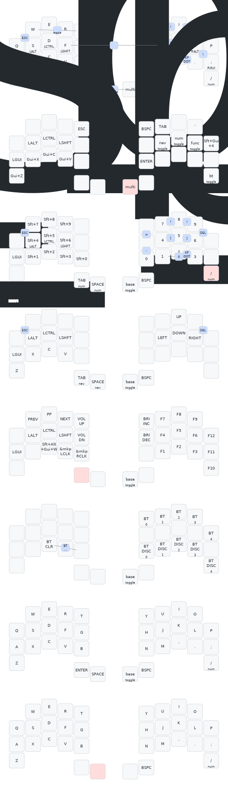

## Local Firmware Building

Script for local ZMK firmware build -> [local_build.sh](./local_build.sh).

It builds the keyboard firmware and stores to temporal folder -> `./_local_build_artifacts`

**Caution:** Be aware that temporal folder will contain all the sources of `ZMK` and all its modules that will consume `>3Gb` of a disk space. 
Better to delete it when you are done. It won't cause any issue. 
During next execution of [local_build.sh](./local_build.sh) it will check does it already downloaded and will refetch it if it needs.

## Keymap

https://keymap-drawer.streamlit.app
